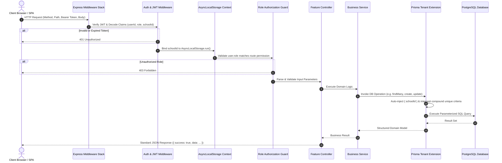
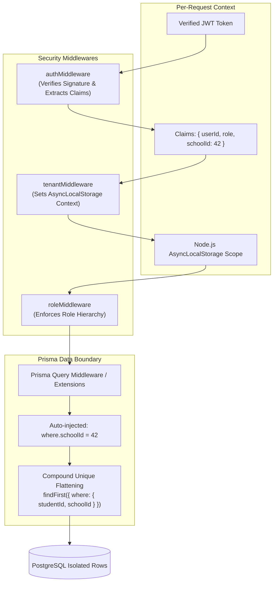
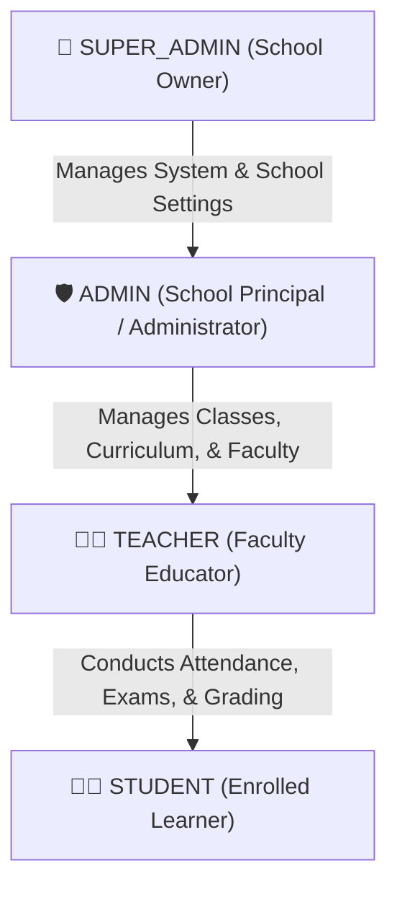
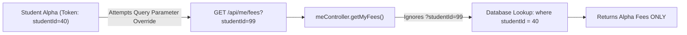
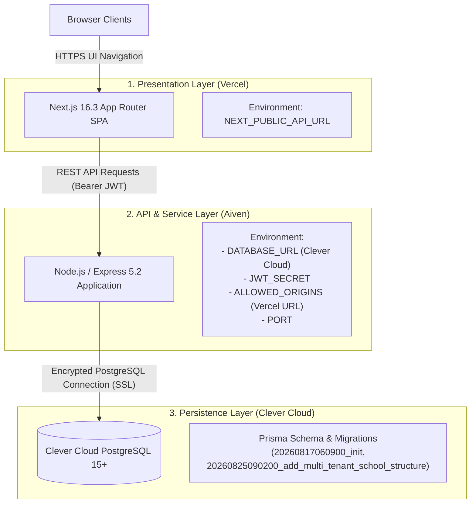

# EduAI Architectural Specification

## 1. System Overview

**EduAI** is designed as a modular, multi-tenant enterprise software system tailored for educational institutions. The application separates concerns into three distinct tiers:
1. **Presentation Layer**: Next.js 16.3 single-page applications with Tailwind CSS and React 19.
2. **API & Service Layer**: Node.js & Express 5.2 application providing stateless REST services with centralized middleware.
3. **Persistence & Isolation Layer**: PostgreSQL database managed via Prisma ORM 7.9 with dynamic `AsyncLocalStorage` tenant context encapsulation.

---

## 2. Request Lifecycle & Execution Pipeline



---

## 3. Frontend Architecture

The frontend is structured under the Next.js App Router architecture:

```
frontend/src/
├── app/
│   ├── layout.tsx              # Root HTML shell & Theme Providers
│   ├── page.tsx                # Public Landing Page & Showcase
│   ├── login/                  # Universal Authentication Entrypoint
│   ├── register/               # Multi-Tenant School Registration Form
│   ├── super-admin/            # Institution Owner Dashboard & Global Controls
│   ├── admin/                  # School Administrator Workspace
│   │   ├── students/           # Student Management & [id] Profile Details
│   │   ├── teachers/           # Faculty Roster & Assignments
│   │   ├── subjects/           # Academic Course & Subject Catalog
│   │   ├── timetable/          # Weekly Schedule Matrix Editor
│   │   ├── attendance/         # Bulk Attendance Register
│   │   ├── exams/              # Exam Planning & Marks Entry [id]
│   │   └── assignments/        # Assignment Creation & Submission Review
│   ├── teacher/                # Faculty Single-Page Portal & Modals
│   └── student/                # Student Self-Service Portal & AI Advisory
│
├── components/
│   └── navigation/
│       └── BackButton.tsx      # Standardized History-Aware Back Navigation
│
├── context/
│   └── AuthContext.tsx         # Universal Session Restoration & User State
│
└── services/
    ├── apiClient.ts            # Central Fetch Client with 401 Interception
    ├── authService.ts          # Authentication APIs
    ├── academicService.ts      # Courses & Departments APIs
    ├── studentService.ts       # Student Management APIs
    ├── teacherService.ts       # Faculty APIs
    ├── subjectService.ts       # Subject Catalog APIs
    ├── timetableService.ts     # Timetable Scheduling APIs
    ├── attendanceService.ts    # Attendance Tracking APIs
    ├── examService.ts          # Exams & Grading APIs
    ├── assignmentService.ts    # Coursework Submissions APIs
    ├── studentPortalService.ts # /api/me Student Scoped APIs
    └── aiService.ts            # AI Recommendations APIs
```

---

## 4. Multi-Tenant Architecture & Data Isolation



### Key Security Principles:
1. **Never Trust Client Tenant Identifiers**: No `schoolId` provided in query parameters or request bodies from the frontend is trusted. The tenant ID is exclusively extracted from the cryptographically verified JWT.
2. **Fail-Closed Async Context**: If an operation attempts to query tenant-scoped models (e.g. `Student`, `Attendance`, `Fee`) without an active `AsyncLocalStorage` school context, the Prisma query extension immediately raises a `403 Forbidden` exception.
3. **Compound Key Translation**: Prisma unique constraints (such as `@@unique([studentId, schoolId])`) are dynamically translated from `findUnique` calls into scoped `findFirst` operations to prevent tenant bypasses.

---

## 5. Role-Based Access Control (RBAC)

EduAI implements a strict role hierarchy with explicit boundary separation:



### Scoping Matrix:
- **SUPER_ADMIN**: Manages global system settings, school owner profile, and administrative configuration for the entire school tenant.
- **ADMIN**: Configures departments, courses, teachers, students, timetables, and fee structures.
- **TEACHER**: Restricted to courses and subjects assigned to their teacher profile. Cannot view or alter fee invoices, school settings, or other teachers' marks.
- **STUDENT**: Strictly restricted to self-service endpoints (`/api/me/*`). Cannot inspect or mutate other students' records or access administrative routes.

---

## 6. Error Handling & Information Disclosure Prevention

The backend utilizes a centralized error handling middleware (`errorHandler.js`):
- **Development vs. Production Separation**: Stack traces, database schema details, and file system paths are strictly withheld from production HTTP responses.
- **Prisma Error Translation**: Prisma specific error codes (e.g. `P2002` Unique Constraint, `P2025` Record Not Found) are normalized into clean HTTP `400`, `404`, or `409` payloads.
- **Standard Error Format**:
```json
{
  "success": false,
  "message": "Human-readable sanitized error description"
}
```

---

## 7. Zero-Trust Resource Ownership (IDOR Prevention)



All `/api/me/*` routes resolve resource ownership strictly through backend database relationships originating from the verified `req.user.id`.

---

## 8. Production Cloud Topology & Security Perimeter

EduAI is deployed across three specialized cloud tiers:



### Security & Deployment Rules:
1. **Authoritative Database**: **Clever Cloud PostgreSQL** is the sole production database.
2. **Strict Secret Boundary**: `DATABASE_URL` and `JWT_SECRET` are strictly isolated to the **Aiven** runtime environment and never exposed to the frontend or Vercel.
3. **Migration Workflow**: Schema updates are applied strictly via `npx prisma migrate deploy` on the backend without resetting or dropping production tables.
4. **CORS Enforcement**: Express backend `ALLOWED_ORIGINS` strictly validates and permits only the authorized Vercel domain.

